# Predicting Cosmetic Product Popularity on Sephora

## Abstract

In the realm of data science and AI-driven marketing strategies, this study was conducted to develop an advanced machine learning model to predict the popularity of cosmetic products sold on the Sephora platform. By analyzing key metrics such as product ratings, the number of customer reviews, and the `love` metric—reflecting user engagement—we aim to uncover relationships between different product characteristics and their overall popularity. Our comprehensive dataset comprises over 1,000 records, featuring 17 attributes, including product ID, brand, category, pricing, and customer feedback. Our methodology involves training a regression model to learn from these features, identifying the relationships between product characteristics and popularity indicators such as ratings and reviews, revealing the key drivers of product success. The model prioritizes these sentiment-driven factors, while also considering secondary variables, such as price, to ensure accurate predictions. This approach enables companies to forecast trends more effectively and design products that align with consumer demand, ultimately enhancing marketing strategies and optimizing personalized shopping experiences in the beauty industry.

## Introduction

In the highly competitive beauty industry, understanding consumer preferences is crucial for crafting effective marketing strategies and designing products that captivate audiences. This study focuses on applying machine learning to predict the popularity of cosmetic products sold on Sephora, one of the leading online beauty platforms. By analyzing over 1,000 records and 17 attributes, ranging from product ratings and customer reviews to the "love" metric that reflects user engagement, the research uncovers key drivers behind product success.

## Method

### Data Exploration

The dataset used in this study provides a strong foundation for analyzing cosmetic products sold on Sephora's platform. With 9,168 entries and 21 columns, it captures key product details, customer engagement metrics, and marketing attributes. Essential fields include product ratings, number of reviews, the "love" metric, brand, category, price, and value price. Marketing-related attributes, such as exclusivity, online-only availability, and limited editions, further enrich the data. The dataset is clean, with no missing values, allowing for smooth exploration. Preprocessing steps include imputing any missing values in critical fields like ratings or reviews, using the mean, median, or mode, and encoding categorical fields, such as brand and category, through one-hot encoding. Numerical fields, including price and engagement metrics, will be standardized to ensure balanced contributions to the machine learning models. To maintain data integrity, outliers in fields like price and reviews will be capped or removed. Additional feature engineering will create variables such as a popularity score derived from ratings, reviews, and love metrics to enhance the dataset's predictive power. Columns like `ID`, detailed descriptions, and `how-to-use` instructions will be removed as they do not contribute to predicting the target variable, which is price. The final dataset will be divided into training, validation, and test sets to evaluate model performance effectively. This structured approach ensures the data is ready for uncovering key drivers of product popularity and building robust machine learning models tailored to the beauty industry.

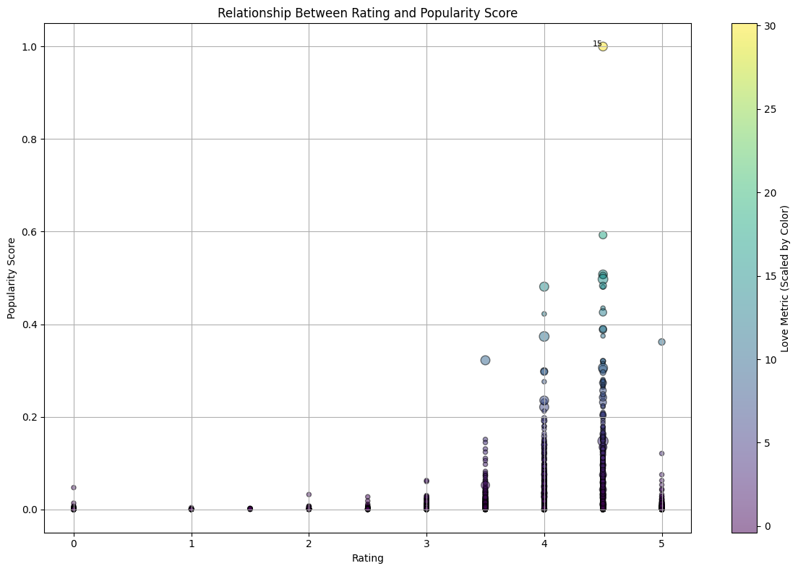

The scatter plot reveals that while most products cluster around average ratings (4.0) and low popularity scores, there is a clear lack of a strong correlation between these two variables. Notably, a few outliers with exceptionally high popularity scores and love metrics stand out, indicating significant disparities in customer engagement and product visibility. These outliers suggest that factors beyond ratings, such as effective marketing or unique product appeal, may drive their higher popularity, highlighting the complexity of consumer behavior in this dataset.

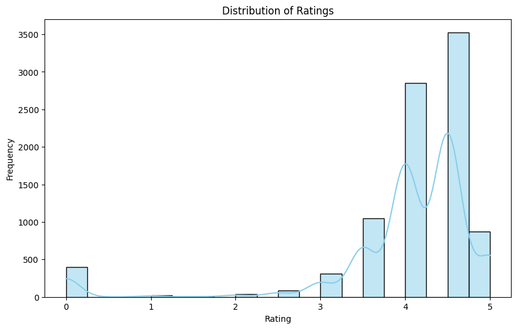

Ratings are mostly positive, centered around higher values (e.g., 4 and above), indicating high customer satisfaction. Few low ratings suggest potential issues in specific product categories.

#### Histograms for Continuous Variables

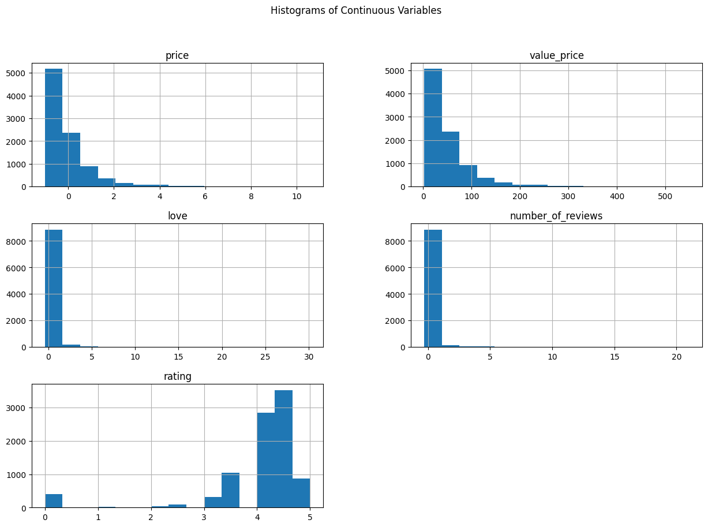

- **Price**: Most products have a price near zero, with very few high-priced items, indicating a heavily right-skewed distribution.
- **Value Price**: Similar to the price distribution, with a long right tail suggesting that a small number of items are much more expensive.
- **Love**: The distribution is heavily concentrated near the lower end, with most products having very low engagement (love count).
- **Number of Reviews**: The majority of products have few reviews, with the count sharply decreasing as the number of reviews increases.
- **Rating**: Ratings are concentrated around higher values, indicating that most products are well-rated.

#### Box Plots for Detecting Outliers

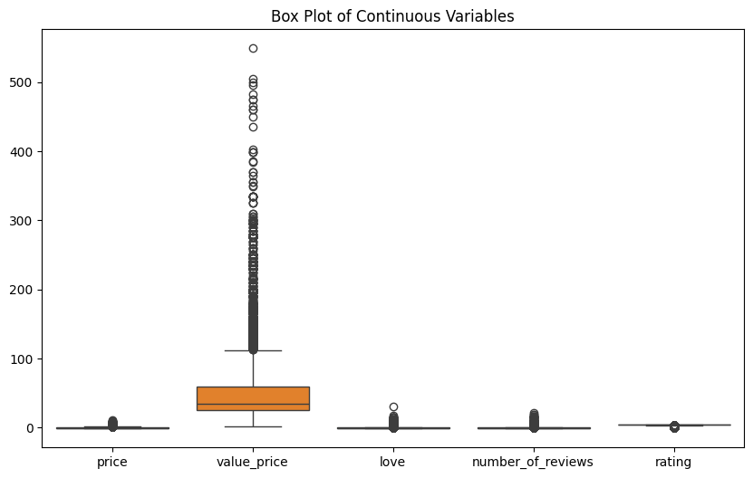

- **Price & Value Price**: Significant outliers, especially in `value_price`, indicate that some products are exceptionally expensive compared to the majority.
- **Love**: A few products have significantly higher love counts, marking them as outliers.
- **Number of Reviews**: Most values are clustered near zero, with some extreme outliers suggesting a few products receive a disproportionately high number of reviews.
- **Rating**: Ratings have a relatively narrow range, with a few outliers.

#### Scatter Plots

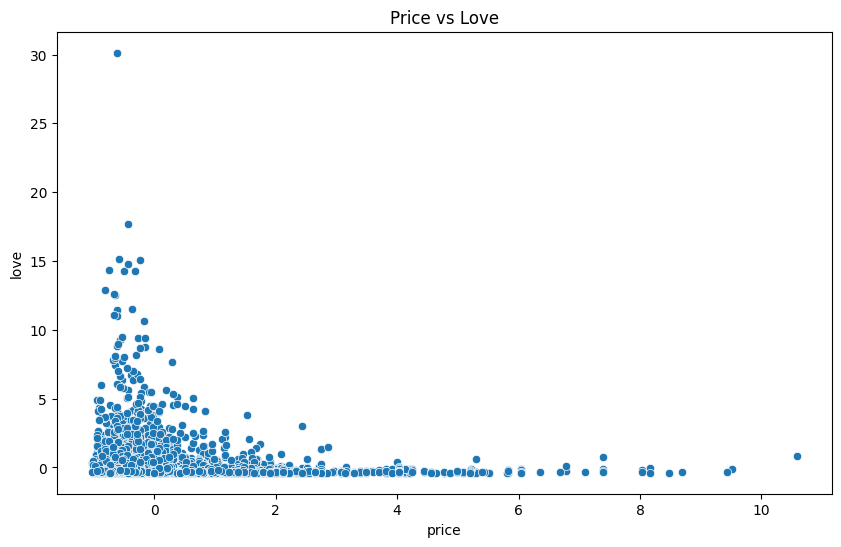

- **Price vs Reviews**: Most products with low prices have fewer reviews, but some expensive products have a high number of reviews.
- **Price vs Love**: Lower prices generally correlate with low love counts, though some expensive products still receive high love counts.
- **Rating vs Reviews**: Higher-rated products tend to have more reviews, though some exceptions exist.

#### Observation:

1. Most products with low prices have fewer reviews, but there are a few expensive products with a high number of reviews. There is no obvious linear relationship.
2. Products with lower prices tend to have low love counts. However, some expensive products still receive high love counts, indicating mixed consumer engagement.
3. Higher-rated products are more likely to have a higher number of reviews, but there are exceptions. Some well-rated products still have few reviews.

#### Correlation Heatmap

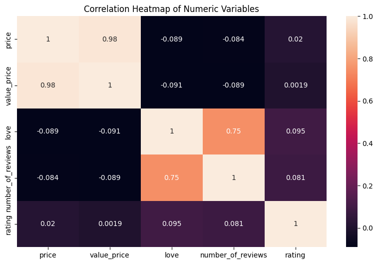

- **Price and Value Price**: Highly correlated (0.98), suggesting redundancy.
- **Love and Number of Reviews**: Moderately correlated (0.75), indicating a potential relationship.

#### Distribution plots for key columns

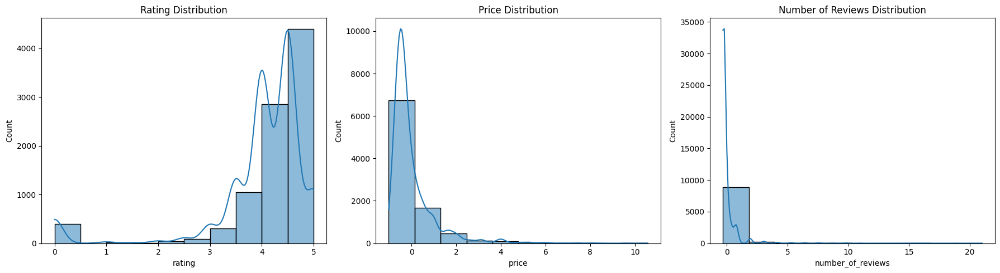

- **Rating**: Ratings are mostly positive, centered around higher values, with a skew towards the upper end.
- **Price**: Prices are heavily skewed towards the lower end, with most products being affordable.
- **Number of Reviews**: The number of reviews is also skewed, with most products having few reviews and a small number having a significantly high count.

---

### Preprocessing

Our project aims to predict the popularity of Sephora products by analyzing metrics like product `ratings`, the number of `reviews`, and the `love` metric. To achieve this, we preprocess the data in the following ways:

1. **Handling Missing Values**:

   - We’ll check for any missing values in critical columns like `rating`, `reviews`, and `love` metrics. For numerical fields (e.g., `rating`, `price`), missing values will be imputed with the median or mean. For categorical fields (e.g., `brand`, `category`), we’ll consider using the mode or adding a category such as "Unknown."
   - After addressing missing values, we will explore the target variable (`rating`) to understand its distribution and behavior. Most products have ratings skewed toward higher values, indicating a general customer satisfaction trend. However, a few lower ratings suggest areas where specific products or categories may need improvement. Visualizing the rating distribution will help highlight these patterns and provide insight into potential anomalies or trends.

2. **Encoding Categorical Variables**:

   - Categorical fields like `brand` and `category` will be encoded. Non-ordinal fields will use one-hot encoding, creating binary columns for each category to ensure compatibility with machine learning models that require numerical inputs.
     - For example, if the `category` field contains values like "lipstick," "foundation," and "mascara," one-hot encoding will create three columns: `category_lipstick`, `category_foundation`, and `category_mascara`, with each row showing 1 in the respective column for its category and 0 in others.

3. **Normalization/Standardization of Numerical Features**:

   - Numerical fields like `rating` and `love` metric values will be standardized or normalized. Standardization (mean = 0, std = 1) is particularly useful for regression models, as it ensures all numerical data contributes proportionally and improves model performance.

4. **Handling Outliers**:

   - Certain fields, like `price` or `number_of_reviews`, may contain outliers that could distort model performance. We will detect these outliers and consider capping or removing extreme values based on their distribution.

5. **Feature Engineering**:

   - Additional features, such as a `popularity_score` calculated from `rating`, `love`, and `number_of_reviews`, may be engineered to better capture a product’s overall appeal. We might also explore grouped features, like price ranges or aggregations for the `brand` and `category` fields.

6. **Dropped Unnecessary Columns**:

   - Columns such as `id`, `name`, `details`, `how_to_use`, `ingredients`, `options`, and `MarketingFlags_content` were removed as they did not contribute to predicting the target variable (`price`).
   - Target Variable: The target variable was set as `price`.
   - Identified Categorical and Numerical Features: Features were divided into numerical and categorical categories:
     - **Numerical Features** were scaled using `StandardScaler`.
     - **Categorical Features** were one-hot encoded using `OneHotEncoder`.

7. **Data Splitting**:
   - The dataset will be split into training, validation, and test sets to evaluate model performance on unseen data effectively.

8. **Parsing and Transforming the size column**:
   - The size column contained a mixture of text-based volume measurements (e.g., "5 x 0.16oz/5mL") and missing values (no size).
     - If the size was listed in milliliters (mL), we extracted the numeric value. For sizes in ounces (oz), they were converted to milliliters using the conversion 1 oz=29.5735 mL1 \, \text{oz} = 29.5735 \, \text{mL}1oz=29.5735mL.
     - Missing values (no size) were replaced with 0.
9. **Target Variable Transformation**:
   - The target variable, price, had a skewed distribution, with a small number of high-priced products causing an imbalance.
   - To stabilize variance and improve the model's performance, we applied a log transformation using: y=log⁡(1+price)y = \log(1 + \text{price})y=log(1+price)


---

### Model 1 – Ridge Regression (Regularized Linear Regression)

To avoid overfitting in the linear regression model, we use Ridge Regression because it addresses overfitting by introducing an \(L^2\) regularization term that penalizes large coefficients. It helps us to prevent the model from becoming overly complex and sensitive to noise in the training data, improving its generalization to unseen data.

The following steps were performed:

1. **Attribute Selection**:

   - Attributes were selected based on their logical connection to the target variable (`price`) and their potential predictive power.
   - The chosen features included:
     - **Numerical**: `rating`, `number_of_reviews`, `total_oz`
     - **Categorical**: `brand`, `category`, `MarketingFlags`
     - **Binary Indicators**: `love`, `online_only`, `exclusive`, `limited_edition`, `limited_time_offer`

2. **Hyperparameter Tuning (GridSearchCV)**:

   - To optimize the Ridge Regression model, GridSearchCV was used to search for the best combination of hyperparameter values.

   - **Regularization Strength Parameter (α)**:

     - The parameter α in Ridge Regression controls the trade-off between minimizing the training error and applying regularization.
     - α was tuned using a grid search over values \([0.1, 1, 10, 50, 100]\).
     - These values were chosen to explore a wide range of regularization strengths:
       - \(0.1\): Allows flexibility in fitting the data with minimal regularization.
       - \(1\): Introduces moderate regularization to reduce the impact of large coefficients.
       - \(10\): Applies stronger regularization, addressing overfitting and multicollinearity.
       - \(50\) and \(100\): Enforce stringent regularization to simplify the model and improve robustness.

   - **5-Fold Cross-Validation**:
     - used to ensure strong evaluation by splitting the training data into five subsets, iteratively using one subset for validation and the remaining for training. It allowed us to assess the model's performance across different subsets of the data, reducing the risk of overfitting to any single train-test split and ensuring the selected α generalizes well to unseen data.

```python
from sklearn.linear_model import Ridge
from sklearn.model_selection import GridSearchCV

model = Ridge()

model_pipeline = Pipeline(steps=[('preprocessor', preprocessor), ('model', model)])

# Define hyperparameter grid for Ridge regression (regularization strength)
param_grid = {
    'model__alpha': [0.1, 1, 10, 50, 100]
}

grid_search = GridSearchCV(model_pipeline, param_grid, cv=5, scoring='neg_mean_squared_error', verbose=2)

```

3. **Data Splitting**: The dataset was split into training (80%) and test (20%) sets using the `train_test_split` function from scikit-learn. The training set was used for hyperparameter tuning and model fitting, while the test set was reserved for final evaluation to assess the model's performance on unseen data.


```python
# Splitting the dataset into training and test sets
X_train, X_test, y_train, y_test = train_test_split(X, y, test_size=0.2, random_state=42)

grid_search.fit(X_train, y_train)
print("Best Parameters:", grid_search.best_params_)

# Making predictions with the best model
y_train_pred = grid_search.best_estimator_.predict(X_train)
y_test_pred = grid_search.best_estimator_.predict(X_test)

```

### Model 2: Decision Tree Regressor

A `DecisionTreeRegressor` was implemented as a second model to predict the log-transformed price of the products. The following steps were followed:

1. **Hyperparameter Tuning**  
   Key parameters for the Decision Tree were optimized using `RandomizedSearchCV`. The parameters tuned were:

   - `max_depth`: [10, 20]
   - `min_samples_split`: [10, 25]
   - `min_samples_leaf`: [2, 10]

   The pipeline for the model was defined as:

   ```python
   model_pipeline = Pipeline([
       ('model', DecisionTreeRegressor(random_state=42))
   ])
   ```

   The hyperparameter tuning was performed using the following code:

   ```python
   param_grid = {
       'model__max_depth': [10, 20],
       'model__min_samples_split': [10, 25],
       'model__min_samples_leaf': [2, 10],
   }

   random_search = RandomizedSearchCV(
       estimator=model_pipeline,
       param_distributions=param_grid,
       n_iter=50,
       cv=5,
       scoring='neg_mean_squared_error',
       random_state=42
   )
   random_search.fit(X_train, y_train)
   ```

   The model was trained using the selected features and validated using 5-fold cross-validation. Predictions were then generated for training and test datasets.

1. **Feature Selection**

   Feature importance scores from a preliminary model were used to identify the most predictive features. Only features with an importance score greater than 0.05 were retained for training the Decision Tree Regressor. This step reduced dimensionality and helped the model focus on the most relevant information.
   The feature selection process:

   ```python
   top_features = importance_df[importance_df['Importance'] > 0.05]['Feature']
   X_train_top = X_train[top_features]
   X_test_top = X_test[top_features]

   ```

1. **Model Training and Evaluation**  
   After identifying the best hyperparameters, the model was trained and evaluated on both the training and test datasets:

   ```python
   y_train_pred = random_search.best_estimator_.predict(X_train)
   train_mse = mean_squared_error(y_train, y_train_pred)

   y_test_pred = random_search.best_estimator_.predict(X_test)
   test_mse = mean_squared_error(y_test, y_test_pred)

   mse_gap = (test_mse - train_mse) / train_mse
   ```


---

## Results

### Model 1 – Ridge Regression (Regularized Linear Regression)

**Evaluation Metrics**:  
The model was evaluated using Mean Squared Error (MSE) and \(R^2\) Score for both training and test datasets. The following metrics were calculated:

- **Training MSE**: 0.35897
- **Test MSE**: 0.36439
- **Training \(R^2\) Score**: 0.64339
- **Test \(R^2\) Score**: 0.62569

**Cross-Validation Results**:

- **MSE (Mean)**: 0.74234
- **MSE (Standard Deviation)**: 0.31625

**Residual Plot**:

- Visualized the residuals to check for patterns and ensure errors are randomly distributed.

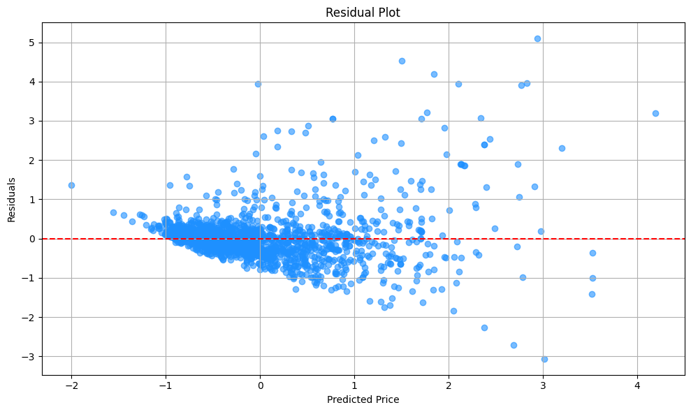

**Distribution of Raw Residuals and Log-Transformed Residuals**:

- Plotted the raw residuals and their log-transformed values to evaluate their distribution.

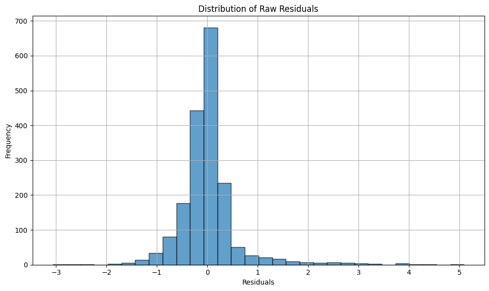

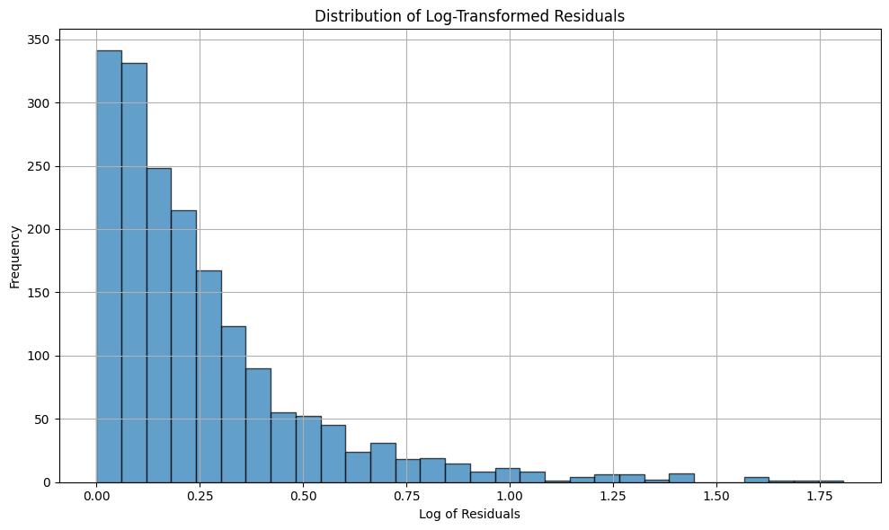

**Predicted vs Actual Value Scatter Plot**:

- Compared the predicted values against the actual values to assess how well the model captures the target variable.

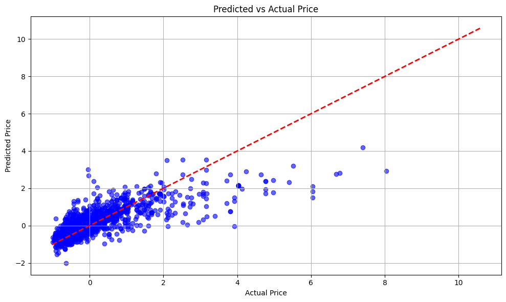


---


### Results for Model 2

#### Feature Selection

The following top features were selected, with their importance scores:

- rating: 0.15
- number_of_reviews: 0.10
- size_ml: 0.09
- love: 0.07
- limited_time_offer: 0.06
  The feature selection reduced the dimensionality of the dataset from 477 to the most relevant features, improving computational efficiency and generalization.
  Hyperparameter Tuning
  After 40 fits, the optimal hyperparameters for the Decision Tree Regressor were identified:
- max_depth: 20
- min_samples_split: 10
- min_samples_leaf: 2
  Model Performance
- Training MSE: 0.3125
- Test MSE: 0.3383
- MSE Gap: 8.24%

#### Figures for model 2

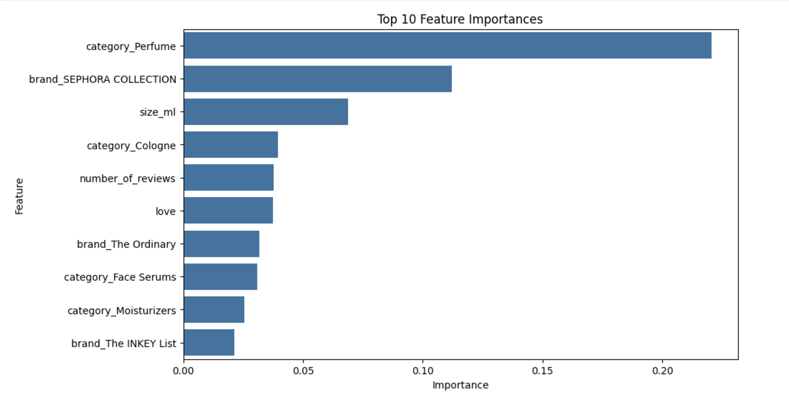
The chart highlights the top 10 features influencing the Decision Tree Regressor. Key contributors include **category_Perfume**, **brand_SEPHORA COLLECTION**, and **size_ml**, emphasizing product category, brand, and size as major factors. Popularity metrics (**number_of_reviews**, **love**) and other categories like **Cologne** and **Moisturizers** also play significant roles.

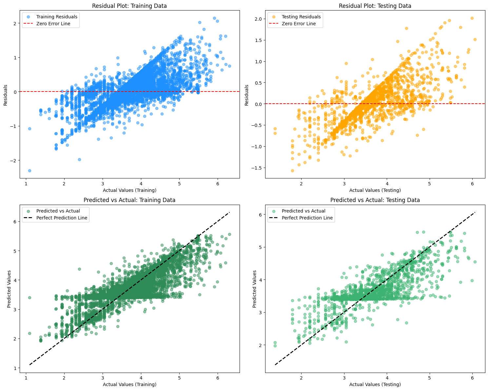

1. **Top Left: Residual Plot (Training Data)**  
   Residuals are centered around zero with some spread, showing the model fits the training data well without significant bias.

2. **Top Right: Residual Plot (Testing Data)**  
   Residuals for the test data are also centered around zero but exhibit slightly more spread compared to the training data, indicating good generalization with minor variance.

3. **Bottom Left: Predicted vs. Actual (Training Data)**  
   Predicted values closely follow the diagonal, indicating accurate predictions on the training data.

4. **Bottom Right: Predicted vs. Actual (Testing Data)**  
   Predicted values align well with actual values but show minor deviations for higher values, reflecting slightly reduced performance on larger targets.

Overall, the model generalizes well with no major overfitting or underfitting issues.
It can also be seen by the Model2's Fit plot:


This graph visually represent where our model 2 stands in terms of fitting, clearly showing the close performance on training and testing data.

## Discussion

Our analysis of predicting cosmetic product prices on Sephora evolved through a thoughtful progression of model development and refinement. Initially, we considered a multiple linear regression approach with potential log transformations and polynomial features. However, our understanding of the data's complexity led us to explore more sophisticated approaches. This evolution began with Ridge Regression to address multiple feature handling and regularization needs, followed by Decision Trees to capture non-linear relationships. Throughout this process, our model selection and tuning decisions were guided by the constant balance between model complexity and generalization capability.

### Model 1: Ridge Regression Analysis

#### Model Fitting Assessment
Our Ridge Regression model demonstrated characteristics of balanced fitting - neither severely underfitting nor overfitting. The residual plots and predicted vs. actual plot analyses revealed that the model captured general data trends while maintaining reasonable variance in residuals. However, we observed that the model may have oversimplified some relationships, particularly for higher-priced items where data points showed greater deviation from the ideal prediction line.

Based on our analysis, the model occupied a middle ground in the fitting spectrum. This was evidenced by the relatively low variance of residuals and reasonable clustering around the line in the predicted vs. actual plot. However, the scatter of residuals and deviation of data points from the red dashed line at higher prices indicated that our model might be over-simplifying some complex relationships between features and the target variable.

#### Future Modeling Directions
Based on these observations, we identified several promising directions for improvement:

1. **Polynomial Regression**: The non-linear patterns observed in our residual plots suggested that polynomial features might better capture the complexity in price relationships.

2. **Tree-based Models**: The limitations in capturing non-linear relationships pointed toward decision trees as a potential solution for modeling complex patterns without requiring strong parametric assumptions.

3. **Support Vector Machines**: The complex, non-linear nature of price relationships suggested that SVMs with RBF kernels could provide better classification boundaries, particularly for handling the nuanced relationships in our data.

### Model 2: Decision Tree Analysis

#### Model Fitting Characteristics
Our Decision Tree model showed promising results with a relatively small MSE gap (8.24%) between training and testing performance, suggesting good generalization to unseen data. This indicated that the model achieved a balance point where it neither oversimplified nor overcomplicated the relationships in the data, fitting squarely in the "ideal" region of a fitting graph.

Through our iterative improvement process, we found that careful parameter tuning was essential for managing the trade-off between model complexity and generalization. While adjusting parameters sometimes led to lower raw accuracy, it often resulted in more robust and reliable predictions across different price ranges.

#### Future Improvements
Based on Model 2's performance, we identified SVR (Support Vector Regression) as a promising next step, chosen for its:
- Effectiveness with small to medium-sized datasets
- Ability to model non-linear relationships using kernels like RBF or polynomial
- Focus on minimizing prediction margins rather than optimizing for absolute accuracy

### Synthesis and Improvement Directions

The insights gained from both models suggest several key directions for future work:

1. **Model Integration**: The complementary strengths of our models suggest that ensemble methods might provide more robust predictions across price ranges.

2. **Feature Engineering**: Both models indicated the importance of better capturing non-linear relationships, suggesting a need for more sophisticated feature engineering.

3. **Market Segmentation**: The varying performance across price ranges suggests that segment-specific models might improve overall prediction accuracy.

Our progression from simpler linear models to more complex approaches, and the systematic way we addressed overfitting through careful parameter tuning, provides valuable insights for future price prediction models in the cosmetics market. While both models showed distinct strengths, there remains room for improvement in capturing the full complexity of cosmetic product pricing, particularly for luxury items and extreme price points.

The evolution of our modeling approach reflects a deeper understanding of the challenges in price prediction and the importance of balancing model complexity with practical utility. Future work with SVR and potential ensemble methods builds naturally on these insights, promising further improvements in prediction accuracy while maintaining robust generalization capabilities.

## Conclusion

### Conclusion for Model 1

Ridge Regression demonstrated robust performance, effectively balancing training and test errors and minimizing overfitting. Future work could explore non-linear models or additional engineered features to further enhance accuracy.

### Conclusion for Model 2

Model 2, a Decision Tree Regressor, demonstrated strong performance in predicting the target variable with minimal overfitting and a small gap between training and testing errors:

- **Performance Metrics**:

  - Training MSE: 0.3125
  - Testing MSE: 0.3383
  - MSE Gap: 8.24%

  These results indicate that the model generalizes well to unseen data while maintaining high accuracy on the training set.

- **Residual Analysis**:

  - Residuals were centered around zero, showing no significant bias in predictions.
  - However, a slight increase in residual variance for higher actual values suggests the model struggles with large target values, a common limitation of decision trees.

- **Strengths**:

  - The model effectively captured the underlying data patterns, as evidenced by close alignment between predicted and actual values in the test set.
  - Feature selection and hyperparameter tuning contributed to its ability to generalize well, avoiding overfitting.

- **Weaknesses**:
  - Slight heteroscedasticity in residuals indicates the model's limitations in handling variability for larger target values.
  - Decision Trees are prone to instability with small changes in data, which may limit robustness.

### Future Directions

To build on the strengths of Model 2 and address its limitations:

- Explore ensemble methods like Random Forests or Gradient Boosting to improve stability and reduce prediction variance.
- Consider Neural Networks or Support Vector Regression to handle non-linear relationships and larger target values more effectively.

Model 2 provides a solid baseline for comparison, balancing accuracy and generalization while revealing areas for further improvement.

## Statement of Collaboration

- Ruiping Fang
  - Visualized residuals and predicted vs. actual values to assess model performance and identify patterns.
  - Drafted concise descriptions for Model 2, including strengths, weaknesses, and performance, and provided a conclusion with future improvement directions.
  - Coordinated with peers to discuss methodology, review results, and ensure project alignment.
  - Assisted peers in debugging and contributed to feature expansion for Model 1.

- Sihan Wang
   - Train the first model and apply Hyperparameter Tuning
   - Evaluate the Model Performance of the first model with visualization
   - Develop Data Exploration by using visualization, like correlation heatmap
   - Accomplish the writing report for model 1
   - Coordinated with peers to discuss methodology, review results, and ensure project alignment
 
- Chenyu Tang
  - Performed initial data exploration analysis, and some visualization plots to understand data relationships
  - Implemented cross-validation techniques for Model 1 to ensure robustness, assisted with hyperparameter tuning for Model 2
  - Wrote the Discussion section for the project report
  - Coordinated with peers to discuss methodology, review results, and ensure project alignment

- Rui Wang
  - Wrote the abstract, introduction, and dataset description for the project report
  - Collaborated on analyzing data exploration
  - Participated in discussions to address overfitting issues in the Decision Tree model, tested various depths and parameter configurations
  - Coordinated with peers to discuss methodology, review results, and ensure project alignment.

- Jialin Hu
  - Contributed to data preprocessing by enhancing normalization techniques to improve data quality and model performance.
  - Trained the second model with Random Forest Resgressor and retrained the second model using the top-selected features to further refine its accuracy and efficiency.
  - Utilized visualization tools to analyze the performance and behavior of the second model.
  - Collaborated with teammates to exchange ideas and implement enhancements for the second model, focusing on feature selection and optimization.
